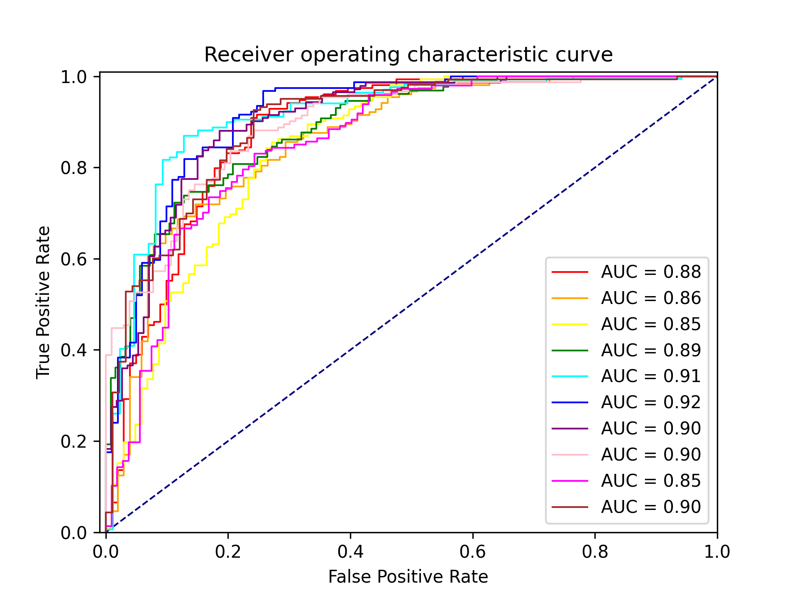
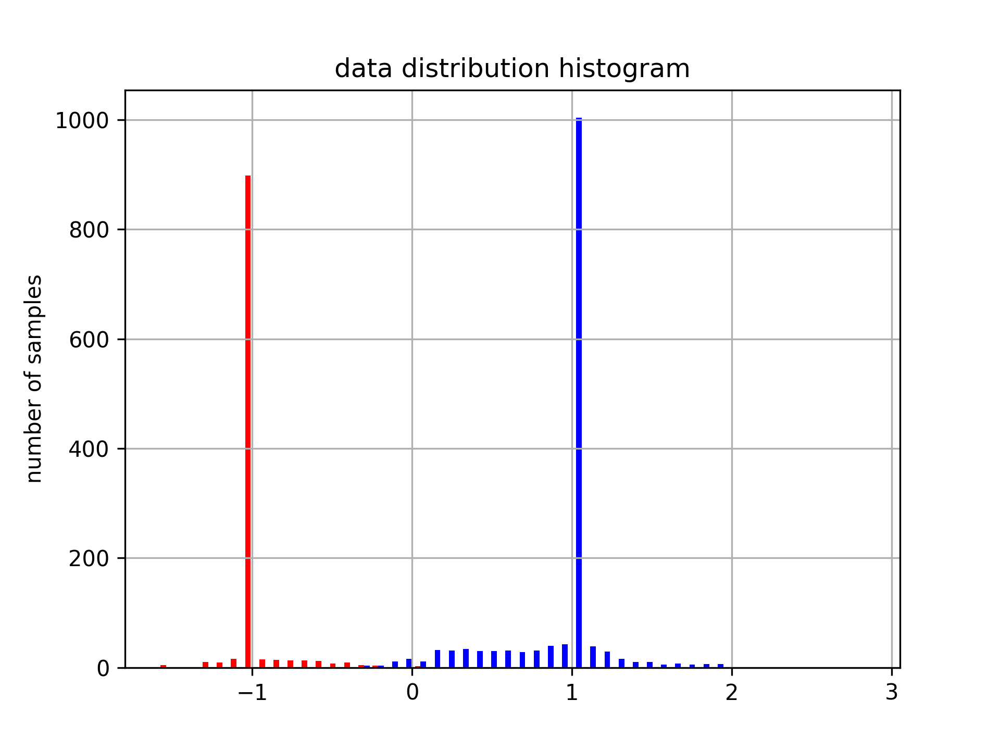
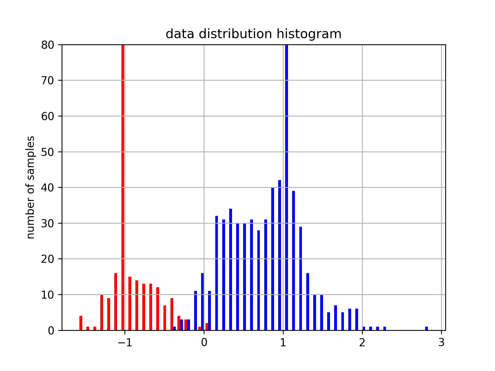
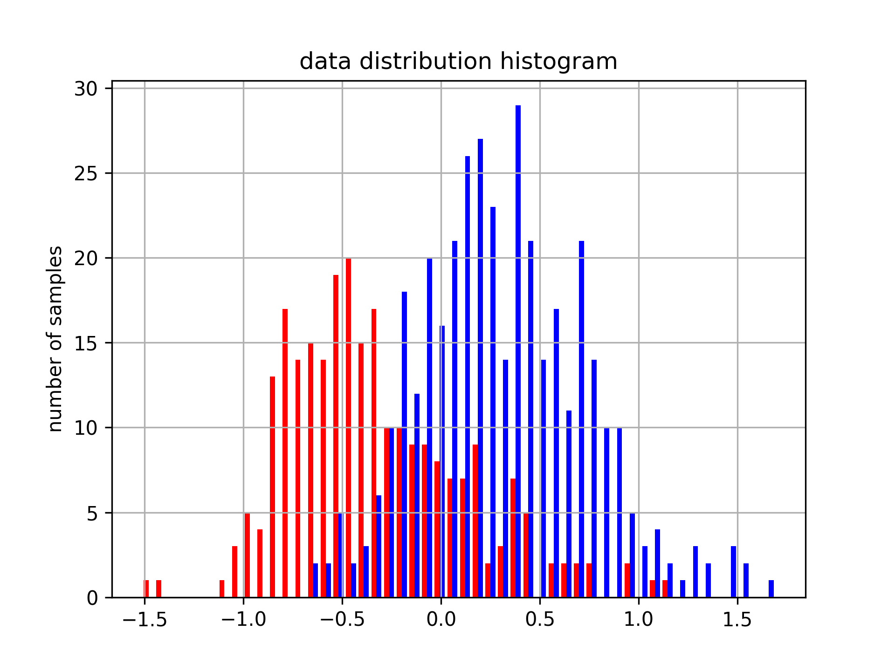
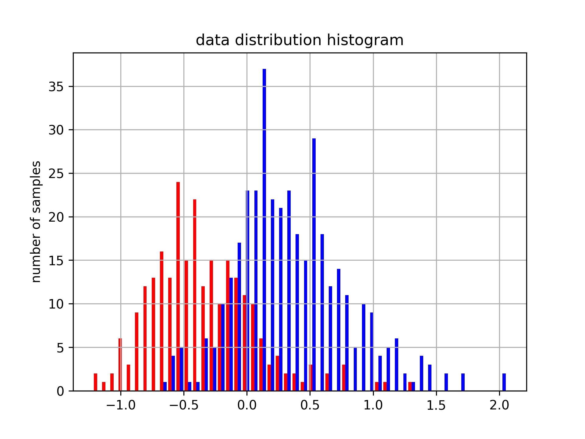
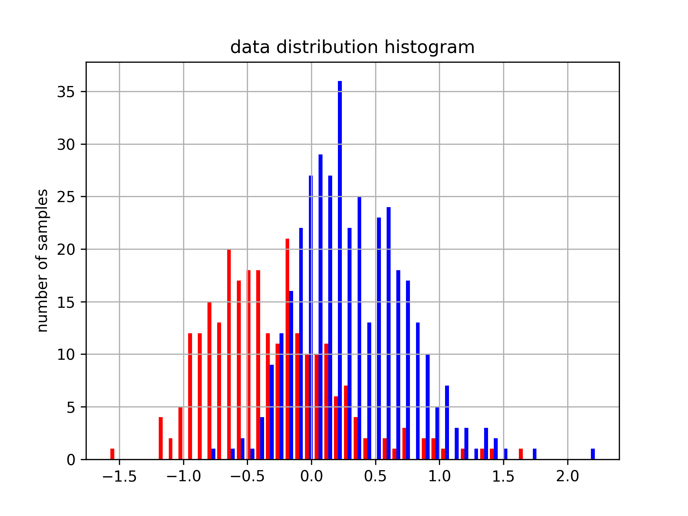

# Spec
### 用 poly 核SVM C=2 degree=2 
|核函数|class_weight|up|low|all
|:---:|:---:|:---:|:---:|:---:|
|poly|1:1|90.83%|69.74%|82.22%|
|poly|1:1.5|85.15%|77.44%|82.02%|
|poly|1:2|81.00%|80.16%|80.65%|
两类正确率的以平衡

### 用 rbf 核SVM C=4 
|核函数|class_weight|up|low|all
|:---:|:---:|:---:|:---:|:---:|
|rbf|1:1|90.50%|68.78%|81.59%|
|rbf|1:1.5|89.10%|69.53%|81.04%|
|rbf|1:2|88.84%|69.44%|80.85%|
|rbf|1:4|88.30%|70.37%|80.93%|
|rbf|1:8|88.30%|70.37%|80.93%|
无论如何加大负类的权值，也没能平衡两类的正确率
用 1:2

### 用综合表现最好的参数画出ROC曲线

参数：`poly` 核，$C=2，degree=2，class\_weight=1:2$ 

进行10折交叉验证，每次利在测试集上作出一条ROC曲线

### 用decision_function() 画出样本分布直方图

用所有样本训练以下参数的SVM后

参数：`poly` 核，$C=2，degree=2，class\_weight=1:2$ 

用decesion_function() 得到各样本到超平面距离，画出分布

放大底部

随机划分 75% 的样本作为训练集，25%作为测试集，训练同以上参数的SVM，用同样的方法，作出测试集样本的分布

重复3次

可见两类的分布是有各自的中心的

### 用 RandomForestClassifier n_estimators=200 max_depth=10 
n_estimators=200 max_depth=10 
|class_weight|up|low|all|
|:---:|:---:|:---:|:---:|:---:|
|1:1|96.17%|52.69%|78.42%|
|1:1.5|91.70%|58.99%|78.30%|
|1:2|86.29%|66.46%|78.10%|
|1:3|74.67%|76.04%|75.04%|
|1:4|63.98%|81.73%|71.07%|

取 class_weight=1:3

# LogMel

### 用 RandomForestClassifier n_estimators=100 max_depth=10 
n_estimators=200 max_depth=10 
|class_weight|up|low|all|
|:---:|:---:|:---:|:---:|:---:|
|1:1|96.10%|45.35%|75.51%|
|1:1.5|89.94%|58.86%|77.28%|
|1:2|81.55%|65.80%|75.12%|
|1:2.5|73.49%|71.94%|72.76%|
|1:3|66.18%|77.08%|70.49%|
|1:4|55.18%|84.12%|66.76%|
最好的是 1:2.5

### 用 poly 核SVM C=2 degree=2 
|核函数|class_weight|up|low|all
|:---:|:---:|:---:|:---:|:---:|
|poly|1:1|91.29%|66.72%|81.24%|
|poly|1:1.5|78.09%|78.06%|77.98%|
|poly|1:2|73.33%|79.76%|75.82%|
1:1.5 两类正确率的以平衡

### 用 rbf 核SVM C=4 
|核函数|class_weight|up|low|all
|:---:|:---:|:---:|:---:|:---:|
|rbf|1:1|89.58%|66.75%|80.30%|
|rbf|1:1.5|89.40%|66.97%|80.25%|
|rbf|1:2|89.26%|66.93%|80.18%|
|rbf|1:4|89.19%|67.02%|80.18%|
|rbf|1:8|89.19%|67.02%|80.18%|

无法平衡两类正确率

# MFCC
### 用 poly 核SVM C=1 degree=1 
|核函数|class_weight|up|low|all
|:---:|:---:|:---:|:---:|:---:|
|poly|1:1|86.66%|64.45%|77.70%|
|poly|1:1.5|78.23%|73.39%|76.29%|
|poly|1:1.7|75.15%|74.48%|75.00%|
|poly|1:2|71.61%|77.57%|74.02%|
最好是1:1.7

### 用 rbf 核SVM C=2 
|核函数|class_weight|up|low|all
|:---:|:---:|:---:|:---:|:---:|
|rbf|1:1|88.82%|60.18%|77.24%|
|rbf|1:1.5|86.80%|62.35%|76.88%|
|rbf|1:2|85.82%|63.02%|76.57%|
|rbf|1:4|85.43%|62.77%|76.22%|
|rbf|1:8|85.43%|62.77%|76.22%|

用1:2 

### 用 RandomForestClassifier n_estimators=250 max_depth=5 
n_estimators=200 max_depth=10 
|class_weight|up|low|all|
|:---:|:---:|:---:|:---:|:---:|
|1:1|99.35%|16.98%|65.93%|
|1:1.5|82.58%|65.83%|75.55%|
|1:1.6|72.58%|73.51%|72.72%|
|1:1.7|62.88%|81.41%|70.21%|
|1:2|34.39%|93.40%|58.16%|
用1:1.6

所用特征和分类器如下

|LogMel|Spectrum|MFCC|
|:-:|:-:|:-:|
|SVM-rbf|SVM-rbf|SVM-rbf|
|SVM-poly|SVM-poly|SVM-poly|
|RandomForest|RandomForest|RandomForest|

# 特征预处理

特征图片均为 $99\times 73$ 的 RGB 图片，转化为灰度图后按行展开为 $7227$ 维的向量，所有样本进行主成分分析法降维，降维参数为保留样本矩阵的 $85\%$ 的方差。 LogMel、Spectrum、MFCC 分别降至460、198、574维。其中 Spectrum 特征的降维效果最好，说明特征信息集中在更少的维度上。

以下对每一个特征-分类器组合都进行了分析，先对每种特征的三种分类器进行对比分析，再对比每种特征的最好结果。

# 分类

确定了分类器后，考虑用 sklearn 库的 Gridsearchcv 函数来搜索最优参数，其做法是对给出的各个参数组合进行枚举后暴力测试，所用的测设方法为5折交叉验证，评价标准为分类正正确率。

各个分类器的搜索范围如下

* SVM-rbf
    C: 1,2,3,4,5
    gamma: 'scale'
    class_weight: {1: 1, 0: 2}, {1: 1, 0: 1}, {1: 1, 0: 1.5}
* SVM-poly
    C: 1,2,3,4,5
    degree: 1,2,3,4
    gamma: 'scale'
    class_weight: {1: 1, 0: 2}, {1: 1, 0: 1}, {1: 1, 0: 1.5}
* RandomForest
    n_estimators: 50,100,150,200,250,300
    max_depth: 5,10,15,20,25,30

其中 SVM 的 `gamma` 参数在手动尝试测试时发现 设置为 'scale' （即根据样本 X 的方差和样本个数进行计算得出的值）是优于所有手动尝试的结果的

## Spectrum
搜索的出的最优参数